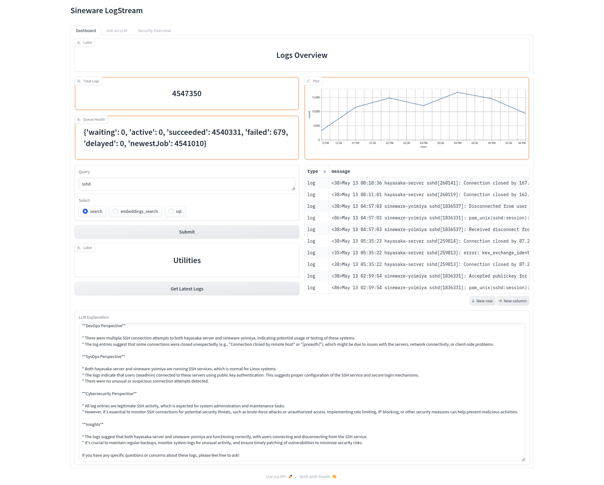

# Sineware LogStream

Collect, Embed, and Query logs from anywhere. LogStream accept standard syslogs over UDP from clients, vectorizes the text, and stores it in Postgres ([pgvector](https://github.com/pgvector/pgvector)).

Sort and query your entire infrastructures logs with local LLMs! LogStream uses Ollama to interact with open-source LLM technology. Rather than store all your logs forever, LogStream works great as part of your larger logging infrastructure, for example, pipe logs from a traditional logging stack into LogStream for LLM insights.

LogStream uses [Gradio](https://www.gradio.app/) to provide a simple web interface for querying logs.



## System Requirements
Storage: 20,000 log entries requires about 1GB of disk space.

RAM: The LogStream service run comfortably on smaller edge devices with 2GB of RAM, however you may need more if you expect large log queue bursts. 

LogStream requires an instance of [Ollama](https://ollama.com/) to run the default `nomic-embed-text` and `llama3` models. For best performance you want a 
supported GPU with at least ~12GB of VRAM. Otherwise you can use CPU acceleration, with ~12GB of system memory.

LogStream can queue thousands of logs per second, however the rate at which logs are processed will be limited by the embedding performance of the Ollama server, 
typically hundreds of logs per second. If you constantly send logs faster than your GPU or CPU can process the text embeddings without a break, your queue will grow indefinitely (until you run out of RAM), so keep an eye on the queue size!

Service clustering for performance scaling and HA is not supported yet, but it is on the roadmap.

## Running
LogStream is a work in progress! **There is no authentication on the Gradio WebUI, do not expose it directly to the internet!**

Create a override.env file with at least:
```env
OLLAMA_HOST=192.168.11.188
OLLAMA_PORT=11435

POSTGRES_PASSWORD=postgres
```

OLLAMA_HOST and OLLAMA_PORT are the address and port of your Ollama server.

POSTGRES_PASSWORD is the password for the internal Postgres/pgvector database and accessing Adminer.

You can further configure LogStream by adding the following to your override.env file:
```env
DROP_EVENTS_OLDER_HOURS=730

EMBED_MODEL=nomic-embed-text
QUERY_MODEL=llama3:8b-instruct-q8_0
```

`DROP_EVENTS_OLDER_HOURS` is the number of hours to keep logs in the database before dropping them. The default is 730 hours (30 days).

`EMBED_MODEL` and `QUERY_MODEL` are the Ollama models to use for embedding and querying logs. Note that changing the embedding model after the first run is not supported yet (you must reset the log database by deleting `runtime-data/pgvector/`).

To run LogStream:
```bash
docker compose up --build -d
```

You can omit the `-d` flag to see the logs in the terminal to help debug during your first launch.

**You can access the Gradio WebUI at `http://localhost:7860/`, and the Adminer (direct Postgres access) interface at `http://localhost:7861/`.**

## Sending Logs
LogStream accepts arbitrary strings as log messages over UDP port 41234. Typically this means you will bring a syslog client to send messages from a particular machine/server. See the `syslog-ng.conf` file for an example [syslog-ng](https://github.com/syslog-ng/syslog-ng) config file.

## Development Tips and Tricks

Rebuild and restart a single compose service:
```bash
docker compose up --build --force-recreate --no-deps webui 
```
